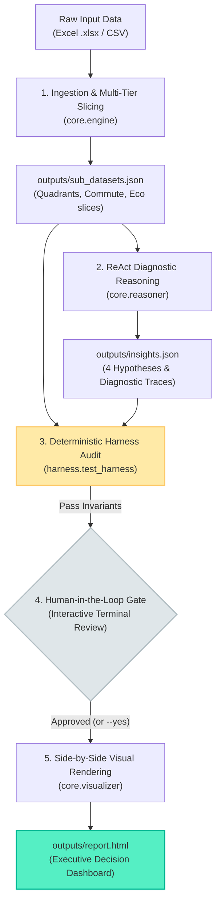

# Data Analysis Skill ⚡

> **A universal, evidence-first automated data analysis skill for Excel and CSV datasets.**  
> Powered by multi-tier sub-dataset slicing, multi-turn ReAct diagnostic reasoning, deterministic code-level harness verification, and side-by-side executive HTML reporting.

[](LICENSE)
[](https://www.python.org/)
[](SKILL.md)
[](#-deterministic-harness-engineering)
[](.github/workflows/ci.yml)
[](examples/sample_executive_report.html)

---

## 📖 Overview

The **Data Analysis Skill** is a general-purpose, evidence-first analytical engine designed to solve a fundamental challenge in agentic AI: **how to derive deep, rigorous, and actionable business attribution from raw tabular data without hallucination, prompt drift, or superficial outputs.**

> [!NOTE]
> ### 📌 Benchmark Case Study & Dataset Provenance
> While this repository implements a universal data analysis pipeline suitable for diverse tabular domains, the **Electric Vehicle (EV) Purchase Decision & Causal Attribution** workflow included here serves as its flagship end-to-end case study and demonstration.
> - **Source Dataset**: Derived from the [Kaggle Playground Series (Season 6, Episode 9: Predicting EV Adoption)](https://www.kaggle.com/competitions/playground-series-s6e9).
> - **Sample Scope**: Demonstrates scaling from small Excel spreadsheets (`examples/sample_ev_data.xlsx`, 5,000 rows) to large production CSVs (668,665 rows) with zero changes to pipeline code.

Rather than treating the LLM as an unconstrained text generator, this skill treats it as a structured reasoning kernel bounded by **deterministic Python data slicing**, an **iterative ReAct diagnostic engine**, and a **code-level test harness**.

The resulting output is not a generic summary, but an **executive-grade single-file HTML dashboard** with interactive KPI metric cards, causal diagnostic traces, and side-by-side chart/table modules.

---

## ✨ Key Capabilities

- **Multi-Tier Sub-dataset Slicing**: Automatically decomposes raw tabular records ($N > 600,000$) into orthogonal, high-signal sub-datasets:
  - *Income × Range Anxiety 4-Quadrant Matrix* (Q1 Premium, Q2 Mass Market, Q3 Low-Income/Low-Anxiety, Q4 Low-Income/High-Anxiety).
  - *Commute Distance × Home Charger Access* (isolating charging infrastructure elasticity).
  - *Eco-Awareness × Income Cohorts* (quantifying ideological vs. economic purchasing drivers).
- **Multi-Turn ReAct Diagnostic Reasoning**: Executes structured `Thought -> Action -> Observation` loops with hypothesis formulation and depth threshold verification ($\ge 0.85$ target depth score).
- **Causal Business Attribution Metric Cards**: Displays 4 mission-critical business metrics with explicit relative deltas against baseline benchmarks:
  - **Policy Incentive Lift**: $+26.89\%$ delta over non-subsidized population.
  - **Range Anxiety Drop**: $-99.30\%$ collapse when anxiety escalates without home charging.
  - **Home Charger Shield**: $99.75\%$ defense buffering against range anxiety.
  - **Q1 Premium Ceiling**: $69.17\%$ conversion ceiling in prime demographic.
- **Side-by-Side Ergonomic Layout**: High-density 50/50 split-screen layout pairing interactive SVG/Canvas charts (with a dashed $17.46\%$ population baseline) with complete sub-dataset summary tables.
- **Interactive Human-in-the-Loop Review Gate**: Halts execution after computing insights and metrics, allowing analysts to review and approve conclusions before compiling final dashboards.
- **Deterministic Code-Level Harness**: Zero-tolerance gate enforcing $N$-record conservation, probability boundaries $[0.0, 1.0]$, causal consistency, and anti-fluff phrase filtering.

---

## 🛡️ Design Principles

| Challenge | Traditional Pitfall | Our Engineering Solution |
| :--- | :--- | :--- |
| **Over-Engineering** | 6–7 uncoordinated subagents with message deadlock. | **Two-Core Architecture**: `core/engine.py` (data slicing) + `core/visualizer.py` (dashboard rendering) with a unified state machine. |
| **Hallucination & Drift** | Relying on polite prompts ("please do not hallucinate"). | **Deterministic Harness Audit**: Hard assertions enforcing record conservation and $\pm 0.01\%$ metric cross-reconciliation. |
| **Attention Degradation** | Shoveling 600k raw rows into prompt context. | **Artifact Sandboxing**: Raw data is pre-sliced into lightweight, structured JSONs (50 lines), compressing token load by $99.9\%$. |
| **Superficial Insights** | Single-pass prompt generating obvious correlations. | **ReAct Multi-Turn Diagnostic Loop**: Formulates hypotheses, executes targeted slice queries, and validates causal mechanisms. |
| **Poor Visual Density** | Unstyled walls of text or full-width vertical stacking. | **Side-by-Side (50/50) Dashboard**: Left-hand interactive charts with benchmark reference lines paired with right-hand responsive sub-dataset tables. |

---

## 🏛️ System Architecture & Workflow



---

## 📥 Installation

### Method 1: OpenAI Codex (Recommended)
1. In Codex (Desktop, CLI, or IDE Extension), start a new session.
2. Ask Codex to install the skill via git repository:
   ```text
   Please install the data-analysis skill from https://github.com/Khara115/data-analysis-skill
   ```
3. Alternatively, invoke `$skill-installer` and provide this repository URL.

### Method 2: Google Antigravity (AGY) / Antigravity 2.0
Clone this repository directly into your Antigravity skills directory:
```bash
# User-level skills directory
git clone https://github.com/Khara115/data-analysis-skill.git ~/.gemini/antigravity-cli/skills/ev-data-analysis

# Or workspace-level skills directory
git clone https://github.com/Khara115/data-analysis-skill.git .agents/skills/ev-data-analysis
```

### Method 3: Claude Code & Cursor
Clone the repository into your workspace tools or `.cursor/skills/` directory:
```bash
git clone https://github.com/Khara115/data-analysis-skill.git tools/ev-data-analysis
```

### Method 4: Standalone Python Environment
```bash
git clone https://github.com/Khara115/data-analysis-skill.git
cd data-analysis-skill
pip install -r requirements.txt
```

---

## 🚀 Usage

### 1. Trigger via LLM Assistant
Once installed in your assistant environment (Codex / Antigravity / Claude):
- **Explicit Trigger**:
  > "Use `$data-analysis` to evaluate `data/ev_sales.xlsx` and identify causal purchase barriers."
- **Natural Language Trigger**:
  > "Analyze the EV consumer dataset at `D:/data/train.csv`. Slice into demographic quadrants, perform root-cause diagnostics, and generate the executive dashboard."

### 2. Standalone CLI Execution
```bash
# 1. Analyze sample Excel dataset with interactive human review gate
python run.py --input examples/sample_ev_data.xlsx --output-dir outputs/

# 2. Analyze full Kaggle dataset (668,665 rows) with automatic approval
python run.py --input "D:\kaggle_s6e9_agent\data\train.csv" --output-dir outputs/ --yes

# 3. Run standalone harness audit verification
python harness/test_harness.py --sub-datasets outputs/sub_datasets.json --insights outputs/insights.json

# 4. Run automated pytest test suite
python -m pytest tests/ -v
```

---

## 📊 Dashboard Showcase

The generated `outputs/report.html` is an executive-level, zero-dependency, self-contained HTML dashboard:

- **Top KPI Metric Cards**:
  - `Policy Incentive Lift`: $26.89\%$ baseline jump with green badge indicator.
  - `Range Anxiety Drop`: $-99.30\%$ collapse with red warning badge indicator.
  - `Home Charger Shield`: $99.75\%$ defense against range anxiety.
  - `Q1 Premium Ceiling`: $69.17\%$ maximum conversion potential.
- **Root-Cause Possibility Diagnostics**:
  - Detailed diagnostic cards for each hypothesis with interactive, collapsible ReAct traces (`Thought -> Action -> Observation`).
- **Side-by-Side 50/50 Modules**:
  - **Module 1**: Demographic Quadrants (High/Low Income vs. High/Low Anxiety) with baseline reference line ($17.46\%$) + structured data table.
  - **Module 2**: Commute & Home Charging Infrastructure Sensitivity + structured data table.
  - **Module 3**: Eco-Awareness & Income Cohort Interactions + structured data table.

---

## 📂 Repository Directory Layout

```
ev-data-analysis-skill/
├── .github/
│   └── workflows/
│       └── ci.yml                 # Multi-platform CI pipeline (Ubuntu & Windows, Python 3.10-3.13)
├── core/
│   ├── engine.py                  # Ingestion, multi-tier slicing, metric computations
│   ├── reasoner.py                # ReAct diagnostic reasoning engine with depth scoring
│   ├── prompts.py                 # Structured prompt management for metrics, layouts & loops
│   └── visualizer.py              # Side-by-side HTML visualizer & Chart.js dashboard compiler
├── harness/
│   └── test_harness.py            # Code-level deterministic audit harness
├── tests/
│   ├── conftest.py                # Pytest fixtures and test data synthesizers
│   ├── test_engine.py             # Unit tests for data slicing & calculations
│   ├── test_reasoner.py           # Unit tests for ReAct diagnostic loops
│   ├── test_visualizer.py         # Unit tests for HTML layout & chart integrity
│   └── test_harness.py            # Pytest wrapper for harness assertions
├── references/
│   ├── clarify.md                 # Interactive intent alignment & Grill-Me protocols
│   ├── ev-causal-contract.md      # L0-L4 causal attribution standards
│   ├── adversarial-review.md      # Adversarial audit protocols
│   └── methods/
│       ├── segmentation-matrix.md # 4-quadrant strategic playbook
│       └── subsidy-elasticity.md  # Price & policy elasticity models
├── examples/
│   ├── sample_ev_data.xlsx        # Lightweight verification dataset (5,000 rows)
│   └── sample_executive_report.html # Pre-rendered reference dashboard
├── outputs/                       # Default output directory for generated artifacts
├── CHANGELOG.md                   # Comprehensive release and version history
├── LICENSE                        # MIT License
├── README.md                      # Complete project documentation
├── requirements.txt               # Production & testing dependencies
├── run.py                         # Unified CLI entrypoint with review gate
└── SKILL.md                       # Machine-readable skill specification for AI agents
```

---

## 🧪 Testing & Verification

The repository includes a comprehensive, 100% self-contained synthetic test suite requiring no external data files:

```bash
# Run all tests with pytest
python -m pytest tests/ -v

# Run engine tests only
python -m pytest tests/test_engine.py -v

# Run ReAct reasoner tests
python -m pytest tests/test_reasoner.py -v

# Run visualizer layout tests
python -m pytest tests/test_visualizer.py -v
```

---

## 📄 License

This project is licensed under the [MIT License](LICENSE).
