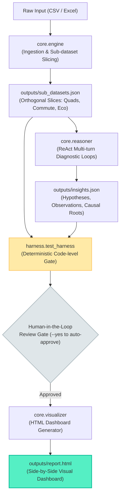

# Data Analysis Skill: Evidence-First Decision System Specification

> **Core Philosophy**: Zero over-engineering. Enforce statistical integrity through deterministic code-level harness assertions, eliminate attention drift via structured intermediate artifacts, and provide executive decision support through ergonomic side-by-side visual layouts.
>
> **Case Study & Benchmark Provenance**: This skill provides a general-purpose, evidence-first framework for tabular data analysis. The **Electric Vehicle (EV) Purchase Decision & Causal Attribution** workflow implemented herein serves as the flagship end-to-end case study. The underlying benchmark dataset originates from the **Kaggle Playground Series (Season 6, Episode 9: Predicting EV Adoption)**.

---

## 1. System Architecture

The skill is built upon a **Two-Core Engine + ReAct Reasoner + Deterministic Harness** pipeline:

```
ev-data-analysis-skill/
├── run.py                 # CLI Entrypoint & Pipeline Orchestrator (with Human Review Gate)
├── core/
│   ├── engine.py          # [Core 1] Data Ingestion, Multi-tier Sub-dataset Slicing, Business Synthesis
│   ├── reasoner.py        # [Reasoner] ReAct Multi-turn Diagnostic Loops (Thought -> Action -> Observation)
│   ├── prompts.py         # Prompt Management (Metric Cards, Split Layout, ReAct Thresholds)
│   └── visualizer.py      # [Core 2] Executive HTML Dashboard Renderer (Side-by-Side 50/50 Layout)
├── harness/
│   └── test_harness.py    # [Harness] Deterministic Code-level Verification Gate
├── tests/                 # Automated Pytest Suite (100% synthetic & deterministic)
│   ├── conftest.py
│   ├── test_engine.py
│   ├── test_reasoner.py
│   ├── test_visualizer.py
│   └── test_harness.py
├── references/            # Deep-dive Protocols & Business Methodologies
│   ├── clarify.md
│   ├── ev-causal-contract.md
│   ├── adversarial-review.md
│   └── methods/
│       ├── segmentation-matrix.md
│       └── subsidy-elasticity.md
├── examples/              # Sample Datasets & Verified Output Artifacts
│   ├── sample_ev_data.xlsx
│   └── sample_executive_report.html
└── outputs/               # Run Artifacts (JSON summaries, diagnostic traces, report.html)
```

### End-to-End Pipeline & Artifact Flow


---

## 2. Key Engineering Mechanisms

### 1. State Machine over Multi-Process Overhead
- **Anti-Pattern**: Spawning 6-7 uncoordinated subagent processes with high inter-process IPC latency and circular loops.
- **Adopted Pattern**: A single unified agent cycling through clean deterministic pipeline states:
  1. **Data Ingestion & Slicing State**: Slices raw records ($N > 600,000$) into 4 quadrants, commute charging clusters, and eco-conscious cohorts.
  2. **ReAct Diagnostic State**: Executes structured multi-turn hypothesis testing with depth scoring ($>= 0.85$ threshold).
  3. **Human Verification State**: Interactive terminal pause displaying primary metrics and findings for human sign-off before artifact generation.
  4. **Rendering State**: Compiles a single-file, zero-dependency, self-contained offline HTML dashboard.

### 2. Deterministic Code-Level Harness vs. Prompt "Praying"
Rather than relying on weak prompt instructions ("please do not hallucinate"), `harness/test_harness.py` enforces mathematical and domain invariant assertions:
- **Total Record Conservation**: $\sum N_{\text{quadrants}} \equiv N_{\text{total}}$
- **Probability Bounds**: $\forall \text{rates} \in [0.0, 1.0]$
- **Causal Directionality**: $\text{BuyRate}_{\text{low\_anxiety}} > \text{BuyRate}_{\text{high\_anxiety}}$
- **Reconciliation Audit**: Any metric referenced in diagnostic conclusions must match the underlying slice JSON within a $\pm 0.01\%$ numerical tolerance.
- **Anti-Fluff Lexicon Filter**: Intercepts generic business cliches ("strengthen promotion", "optimize user experience") and mandates quantified cohort assignments.

### 3. Visual Ergonomics & Split-Screen Information Architecture
- **4 Metric Cards with Relative Deltas**:
  - `Policy Incentive Lift`: $+26.89\%$ delta over non-subsidized cohort.
  - `Range Anxiety Drop`: $-99.30\%$ collapse when anxiety escalates without home charging.
  - `Home Charger Shield`: $99.75\%$ defense against range anxiety.
  - `Q1 Premium Ceiling`: $69.17\%$ conversion ceiling in high-income, low-anxiety cohort.
- **50/50 Side-by-Side Layout**:
  - **Left Column**: High-resolution SVG/Canvas visual charts featuring a benchmark reference dashed line ($17.46\%$ population baseline).
  - **Right Column**: Structured sub-dataset evidence table detailing record count ($N$), conversion rate, and percentage delta.

---

## 3. Standard CLI Execution

```bash
# 1. Run pipeline on Excel dataset with interactive human review gate
python run.py --input examples/sample_ev_data.xlsx --output-dir outputs/

# 2. Run pipeline on full Kaggle 668,665-row dataset in non-interactive batch mode
python run.py --input "D:\kaggle_s6e9_agent\data\train.csv" --output-dir outputs/ --yes

# 3. Execute standalone code harness audit
python harness/test_harness.py --sub-datasets outputs/sub_datasets.json --insights outputs/insights.json

# 4. Run automated test suite
python -m pytest tests/ -v
```
