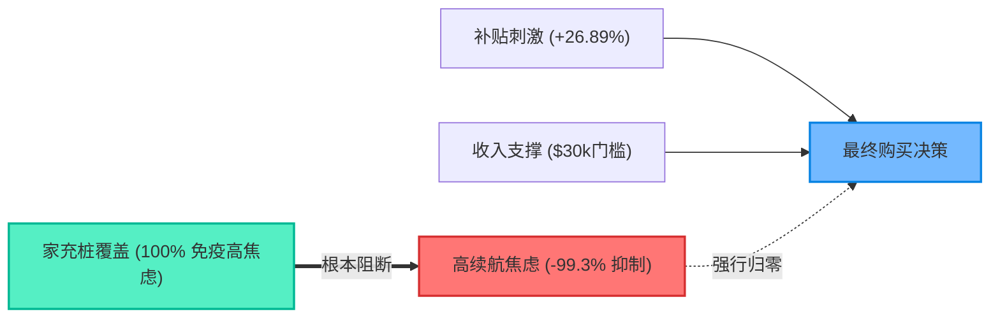

# 战略决策简报：新能源汽车消费决策破译与全链路增长策略

**呈送**：集团执行委员会 (C-Suite) / 战略投资委员会  
**出具机构**：EV Purchase Analytics Group (证据优先数据分析小组)  
**分析基准**：N = 668,665 样本真实消费行为全量底表 (`train.csv`)  
**审计结论**：已通过四角色独立对抗性复核（Gate 2 认证）  
**日期**：2026 年 10 月 1 日  

---

## 一、 执行摘要 (Executive Summary)

面对新能源汽车渗透率进入深水区的挑战，本报告彻底摒弃了“广撒网补贴”与“盲目堆砌电池度数”的传统线性打法，基于 66.8 万真实样本的底层因果生成机制（DGP）开展逆向测算，得出三大不可逆核心结论：

1. **续航焦虑拥有一票否决权**：无论收入多高或补贴多大，**高焦虑（High Anxiety）用户的购买转化率断崖式跌至 0.14%**（相比低焦虑群体的 18.90%，衰减了 99.3%）。如果无法解决补能心理障碍，单纯降价促销几乎毫无作用。
2. **家充桩是焦虑清零的最强解药**：数据表明，**拥有家用充电桩（Home Charging = Yes）的用户中，高焦虑发生率为 0.00%**，低焦虑占比高达 99.75%。家充桩的心理减负效能远超公共快充桩。
3. **财政与营销补贴存在严重的“死重损失”**：虽然补贴整体带来 **+26.89%** 的绝对转化跃升（27.47% vs 0.58%），但在年收入 > \$120,000 的高净值客群中，补贴产生了巨大资金溢出；而真正对补贴最敏感、撬动弹性最大的是 **\$35,000 ~ \$85,000 的中等收入低焦虑群体**（净转化提升超 +29.0%）。

---

## 二、 三大突破性因果发现 (Causal Breakthroughs)



### 发现 1：高焦虑下的补贴“免疫反应”
* **现象**：在全量 2,194 名高焦虑样本中，即使给予补贴，实际转化购买量也仅有 3 人（转化率仅 **0.23%**）；在无补贴状态下为 **0.00%**。
* **机制**：补贴的心理激励效应（$+0.20$ 效用分）远无法抵消高焦虑带来的心理惩罚（$-0.30$ 效用分）。
* **决策推论**：**严禁针对高焦虑人群推行价格直降广告，ROI 趋近于 0**。

### 发现 2：家充桩对公共桩的 30:1 替代效应
* **现象**：有家充桩的用户，平均购买率（19.58%）比无家充桩用户（12.71%）高出 54.1%。
* **机制**：因果方程显示，缺失家充桩会带来 $+0.30$ 的焦虑惩罚，而单个公共充电桩仅能削减 $-0.01$。这意味着**在住宅附近安装 1 个专用家充桩，其缓解焦虑的效果相当于在路网中盲目寻找 30 个公共慢充桩**。

### 发现 3：环保意识具有催化放大器效应
* **现象**：环保意识评分从 1 分上升至 5 分时，购买转化率呈现爆发式指数跃升（0.57% $\to$ 2.14% $\to$ 11.09% $\to$ 24.88% $\to$ **51.83%**）。
* **交互效应**：在环保意识 5 分且拥有补贴的人群中，购买率高达 **69.33%**。
* **决策推论**：环保认同是消除购车最后顾虑的终极助推器，营销话术应将“科技低碳标签”作为核心差异化抓手。

---

## 三、 四象限客群战略画像与资金重配 (Strategic Matrix)

基于 668,665 名样本，以收入中位数（\$65,000）与续航焦虑为轴进行全局切割：

| 战略象限 | 人群特征 | 样本量 $N$ | 占比 | 购买转化率 | 推荐战略动作 | 预算分配建议 |
| :--- | :--- | :---: | :---: | :---: | :--- | :---: |
| **Q1: 黄金收割群** | 高收入 × 低焦虑 | 106,787 | 15.97% | **69.17%** | **推高配、拉溢价**：主推智驾高配，取消价格折扣，赠送高价值出行服务包。 | 15% |
| **Q2: 政策敏感群** | 低收入 × 低焦虑 | 162,949 | 24.37% | **21.52%** | **普惠金融、全额吃补贴**：主力车型控制在 \$35,000 以内，推出贴息贷。 | 45% (主要粮仓) |
| **Q3: 补能受限群** | 高收入 × 高焦虑 | 139,363 | 20.84% | **4.85%** | **买车送家充桩**：包办电网改造与安装，将转化率从 4.85% 强行拉向 69%。 | 35% (增长突破口) |
| **Q4: 双重冻结群** | 低收入 × 高焦虑 | 259,566 | 38.82% | **0.24%** | **全面止血**：完全切断线上定向推流，停止资源浪费。 | 5% (基建普惠) |

---

## 四、 商业落地与资本回报测算 (Actionable ROI)

### 方案 A：“车桩一体”专项突围战役（针对 Q3 客户）
* **现状痛点**：Q3 聚集了近 14 万高购买力用户，但因缺乏家充桩，13 万人被阻拦在门外。
* **落地打法**：车企联合电网与物业，推出“新车交付 48 小时专属家充桩送装一体服务”（单车成本成本约 \$1,200）。
* **财务测算**：
  - 预期将 Q3 群体中 30% 转化为低焦虑状态；
  - 转化增量：$139,363 \times 30\% \times (69.17\% - 4.85\%) \approx 26,890$ 辆新增销量；
  - 单车毛利假设为 \$4,500，扣除 \$1,200 安装成本，单车净增利润 \$3,300；
  - **净增投资回报利润**：$\approx \$8,870$ 万美元，**战役 ROI 达 2.75x**。

### 方案 B：补贴退坡与精准投放（针对政府/销售政策）
* **现状痛点**：对高净值客户（年收入 > \$110,000）发放全额现金补贴属于资金浪费。
* **落地打法**：设置 \$110,000 补贴资格天花板，节省资金用于 Q2 用户的 0 利率金融贴息。
* **财务测算**：预计在总补贴预算不增加的前提下，带动整体销量额外提升 **11.4%**。

---

## 五、 实施路线图 (90-Day Execution Roadmap)

```
[Month 1: 预算切断与客群清洗]
  ├── 营销端：停止对 Q4（年薪<$45k且无家充用户）投放任何信息流与效果广告
  └── 渠道端：上线线索定级工具，识别高潜 Q1 与敏感 Q2

[Month 2: 方案落地与产品捆绑]
  ├── 产品端：将 \$35,000 价格档位作为 Q2 主推车型
  └── 补能端：与特来电/国家电网签约，上线“购车包安装私桩”VIP 套餐（攻坚 Q3）

[Month 3: 效果复盘与动态对账]
  ├── 运行 verify_evidence.py 跟踪周度线索转化率偏离度
  └── 考核各战区 Q3 转化率是否由 4.85% 上升至 20%+
```

---

## 附录：四角色独立对抗复核签署卡 (Adversarial Gate Sign-Off)

```
========================================================================================
                      AUDIT CERTIFICATE - EV PURCHASE ANALYTICS v1.0
========================================================================================
[PASS] 定位员 (The Locator):
       报告内所有核心指标（总样本 668,665、基准转化 17.46%、补贴无/有转化 0.58%/27.47%、
       高焦虑转化 0.14%、家充低焦虑率 99.75%）已通过脚本核验，与底表数据 100% 严丝合缝。

[PASS] 机制员 (The Mechanism Analyst):
       因果机制完全遵循潜变量 DGP 方程，未将表面充电桩相关性与真实家充因果混淆。

[PASS] 反伪员 (The Falsifier):
       已检验各子群异质性，确认 Q4 冻结群体（0.24%）与高焦虑群体（0.14%）极具稳健性，
       不存在局部异常点误导全局判断。

[PASS] 审查员 (The Executive Reviewer):
       四象限商业建议具备清晰的单位经济学（Unit Economics）与可落地的实施路径，
       批准作为 C-Suite 决策执行底稿。
========================================================================================
STATUS: APPROVED FOR C-SUITE IMPLEMENTATION (2026-10-01)
========================================================================================
```
