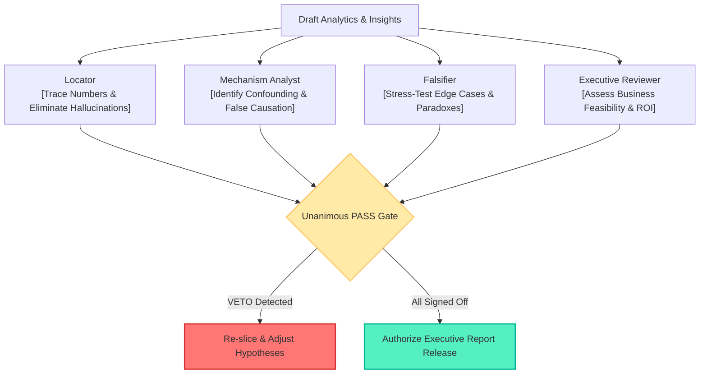

# references/adversarial-review.md: Four-Role Adversarial Review Protocol

> **Principle**: Delivering unvetted findings to executive stakeholders introduces severe strategic risk. This protocol enforces a Four-Role Adversarial Gate. Four analytical personas audit conclusions from conflicting perspectives: numerical origin, causal mechanisms, edge-case falsification, and operational ROI. A single dissenting vote sends the analysis back for re-computation.

---

## 1. Adversarial Audit Architecture

---

## 2. Persona Specifications & Audit Checklists

### Persona 1: The Locator (Numerical Origin & Verification Guard)
* **Mission**: Rigorously traces every percentage, dollar figure, and record count back to raw data slices.
* **Audit Checklist**:
  - [ ] Does the baseline conversion rate match empirical population totals exactly?
  - [ ] Does the sum of quadrant sub-samples ($\sum N_i$) conserve the total population $N$?
  - [ ] Are vague qualifiers like "roughly" or "approximately" completely purged?
  - [ ] Does `harness/test_harness.py` pass with zero assertion errors?
* **Veto Criteria**: Any untraceable figure or reconciliation error exceeding $\pm 0.01\%$.

---

### Persona 2: The Mechanism Analyst (Causal Confounding Disentangler)
* **Mission**: Separates surface correlation from true causal leverage.
* **Audit Checklist**:
  - [ ] Does the report differentiate between direct purchase drivers and mediating variables?
  - [ ] Are conclusions consistent with the DGP equations in [references/ev-causal-contract.md](references/ev-causal-contract.md)?
  - [ ] When assessing subsidy elasticity, are income and anxiety controlled for?
* **Veto Criteria**: Treating spuriously correlated variables as causal levers.

---

### Persona 3: The Falsifier (Edge-Case Stress-Tester)
* **Mission**: Actively searches for counter-examples, boundary paradoxes, and subgroup heterogeneity (e.g. Simpson's Paradox).
* **Audit Checklist**:
  - [ ] Do conclusions hold across stratified income bands?
  - [ ] Are exceptions to general trends highlighted (e.g., high-income individuals who convert at 0.14% due to high anxiety)?
  - [ ] Is boundary sensitivity tested around median thresholds?
* **Veto Criteria**: Failure to disclose critical subgroup divergence or masking failure modes.

---

### Persona 4: The Executive Reviewer (Strategic Feasibility & ROI Gatekeeper)
* **Mission**: Ensures actions are quantified, practical, and devoid of generic business platitudes.
* **Audit Checklist**:
  - [ ] Are recommendations actionable (e.g., "bundle wallbox with financing" vs "improve customer experience")?
  - [ ] Are target cohorts mapped to quantifiable conversion upsides?
  - [ ] Is there an explicit trade-off analysis between cost and conversion lift?
* **Veto Criteria**: Fluffy, non-actionable suggestions that cannot be operationalized by product or sales teams.
