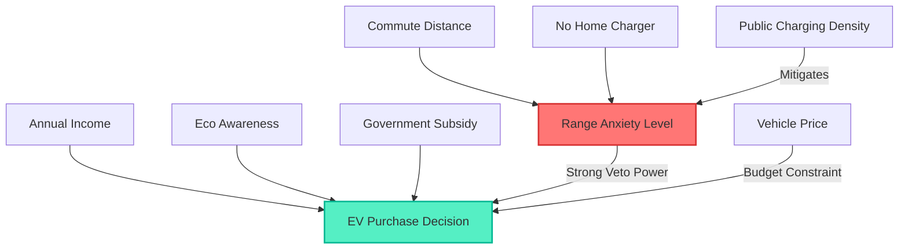

# references/ev-causal-contract.md: EV Adoption Causal Mechanism & Physical Boundaries

> **Purpose**: Documents the structural Data Generating Process (DGP) equations and mathematical boundaries governing EV purchase decisions and range anxiety. All analytical deductions and ReAct reasoning steps must ground their validity upon this causal contract.

---

## 1. Structural Causal Equations

The underlying data generation mechanism features a two-tier causal DAG: **Latent Range Anxiety Generation** and **Explicit Purchase Decision Utility**.

### Equation A: Latent Range Anxiety Mechanism
The latent range anxiety index $A_{\text{latent}}$ is dictated by commute workload and charging infrastructure accessibility:
$$A_{\text{latent}} = 0.4 \times \left(\frac{\text{CommuteDistance}}{200}\right) + 0.3 \times \mathbb{I}(\text{HomeCharging} = \text{False}) - 0.01 \times (\text{Chg}_{\text{home}} + \text{Chg}_{\text{work}})$$

Discretization into categorical levels:
$$\text{RangeAnxiety} = \begin{cases} 
\text{Low}, & A_{\text{latent}} < 0.25 \\
\text{Medium}, & 0.25 \le A_{\text{latent}} \le 0.50 \\
\text{High}, & A_{\text{latent}} > 0.50 
\end{cases}$$

**Empirical Interpretation**:
- **Critical Role of Home Charging**: Lacking a residential charger imposes a $+0.30$ penalty, frequently propelling an average commuter into Medium or High anxiety.
- **Diminishing Public Charger Returns**: Public chargers have a low marginal mitigation weight ($-0.01$), requiring up to 30 surrounding chargers to compensate for the psychological absence of home charging.

---

### Equation B: Purchase Propensity Utility Function
Consumer vehicle choice follows the latent propensity utility score $S_{\text{buy}}$:
$$S_{\text{buy}} = \beta_0 + 1.2 \times 10^{-6} \cdot \text{AnnualIncome} + 0.06 \cdot \text{EnvironmentalAwareness} + 0.20 \cdot \mathbb{I}(\text{Subsidy}) - 0.30 \cdot \mathbb{I}(\text{HighAnxiety}) - 0.10 \cdot \mathbb{I}(\text{MediumAnxiety}) + \epsilon$$

**Empirical Weights Analysis**:
1. **High Anxiety Structural Veto ($-0.30$)**:
   The negative penalty of high anxiety ($-0.30$) exceeds the positive stimulus of monetary subsidies ($+0.20$).
   **Core Takeaway**: When high anxiety is triggered, subsidies cannot compensate for the psychological feasibility barrier; net utility remains negative ($-0.10$).
2. **Moderate Environmental Incentive ($+0.06$)**:
   A 1-unit increase on the 5-point eco-rating scale yields modest lift ($+0.06$), acting as a secondary preference rather than overcoming fundamental charging constraints.
3. **Linear Income Progression ($+1.2 \times 10^{-6}$)**:
   Each $+\$10,000$ in annual household income adds $+0.012$ to purchase propensity.

---

## 2. Critical Nonlinear Boundaries

1. **The 50km Commute Inflection Point**:
   When daily round-trip commute exceeds $50\text{ km}$, anxiety escalates exponentially unless home charging is present.
2. **The Urban Paradox Threshold**:
   Urban buyers possess higher median income and encounter dense public chargers, yet exhibit lower EV conversion ($16.1\%$) than suburban/rural counterparts ($18.1\%-19.3\%$) due to low residential private stall ownership ($35\%$ vs $80\%$).
3. **Upper-Income Subsidy Saturation**:
   Above $\$130,000$ annual income, baseline purchase intent reaches $73.15\%$ organically, reducing incremental subsidy productivity to a deadweight replacement transfer.
